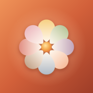

<div align="center">



# Tepore

**Il diario delle emozioni.**
Otto intensità, una nota, un calendario che si colora giorno dopo giorno.

[](#installazione-su-iphone)
[](#compatibilità)
[](#privacy)
[](#stack)
[](#licenza)

</div>

---

## Perché esiste

La maggior parte dei mood tracker chiede una cosa sola: *da 1 a 10, come stai?* Ma una giornata non è un numero. Può contenere gioia e attesa insieme, oppure una rabbia sottile sotto una calma apparente.

Tepore parte dalle **otto emozioni primarie di Plutchik** e chiede quanto hai sentito ciascuna. Niente punteggio finale, niente obiettivi, niente serie da non interrompere: solo un gesto breve, ogni sera, e un mese che pian piano prende colore.

Il nome dice il tono: *tepore*, il calore mite di una cosa che ti sta vicino senza scottare.

> **L'app non giudica.** Nessuna diagnosi, nessuna metrica di "benessere", nessuna notifica che ti fa sentire in colpa. Se una giornata è piatta, c'è un interruttore anche per quella.

---

## Cosa fa

### Oggi

| | |
|---|---|
| **Ritratto del giorno** | Le otto forme disposte in cerchio crescono e si illuminano con l'intensità che hai segnato. Sotto, un'aura di colore sfocato respira lentamente: è la giornata vista da lontano. |
| **Otto slider a scatti** | Sei livelli, da *Per niente* a *Moltissimo*. Si trascinano col dito, con un tick aptico a ogni scatto, oppure si usano dalla tastiera. |
| **Scheda dell'emozione** | Il cerchietto **i** in fondo alla riga apre un foglio in stile iOS con la spiegazione dell'emozione. Si chiude trascinandolo verso il basso. |
| **Apatia** | *Oggi non ho sentito nulla.* La sezione degli slider si richiude con un'animazione; i valori restano salvati e tornano appena la riapri. |
| **Nota della giornata** | Testo libero con salvataggio automatico mentre scrivi. |
| **Promemoria serale** | Un invito gentile alle 22, solo se la giornata è ancora vuota. Si accende dalle impostazioni. |
| **Giorni passati** | Dal calendario si apre qualsiasi giornata già trascorsa e la si completa. |

### Calendario

Il mese corrente, una casella per giorno, con la **forma e il colore** dell'emozione prevalente. Una card riassume il mese (*«Settembre ha il colore della gioia»*) con la distribuzione in una barra, e una legenda ricorda quale forma corrisponde a quale emozione.

### Quaderno

Tutte le note in una timeline verticale, dalla più lontana alla più recente, raggruppate per mese. Un tocco su una nota riapre quella giornata.

---

## Le otto emozioni

| | Emozione | Colore | Forma | Opposta a |
|---|---|---|---|---|
| 🟡 | **Gioia** | `#EEB02F` ambra | cerchio | Tristezza |
| 🟢 | **Fiducia** | `#7FA05D` salvia | quadrato arrotondato | Disgusto |
| 🟣 | **Paura** | `#8F6293` prugna | rombo | Rabbia |
| 🟠 | **Sorpresa** | `#EF8C5C` albicocca | stella a quattro punte | Attesa |
| 🔵 | **Tristezza** | `#6F89A8` ardesia | goccia | Gioia |
| 🟤 | **Disgusto** | `#93633F` nocciola | esagono | Fiducia |
| 🔴 | **Rabbia** | `#C93B2F` mattone | triangolo | Paura |
| 🌸 | **Attesa** | `#DB869C` rosa antico | semicerchio | Sorpresa |
| ⚪ | **Apatia** | `#B3A89E` grigio caldo | anello | — |

Colore **e** forma insieme: il calendario resta leggibile anche a chi non distingue i colori.

---

## Il progetto visivo

Carta, cacao e brace. Nessun colore freddo puro, nessun grigio neutro: anche le ombre sono tinte di marrone. Fraunces per i titoli, Figtree per l'interfaccia, una grana di carta appena percettibile sopra tutto.

```
--paper    #F5ECE0   il fondo, carta appena ingiallita
--surface  #FFF9F1   le card
--ink      #33241D   il testo, cacao scuro
--ember    #D2603A   l'accento, brace
```

Il tema scuro non è un'inversione: è un **espresso**. Fondo `#1F1713`, brace che schiarisce a `#F2A46E`, aure che si fondono in `plus-lighter`.

Dai dettagli Apple arrivano il *liquid glass* della tab bar, l'aptica a ogni scatto, le gesture e le safe area; da Claude il calore e l'accoglienza.

---

## Privacy

**Nessun server, nessun account, nessun tracciamento.** Tutto vive in `localStorage`, sul dispositivo, sotto la chiave `tepore:v1`.

### Il backup non è un optional

Su iOS una web app installata ha un contenitore dati tutto suo, separato da Safari, e **quel contenitore viene eliminato insieme all'icona**: rimuovendo Tepore dalla schermata Home spariscono tutte le giornate. Nessuno storage del browser sopravvive, IndexedDB compreso.

Per questo *Impostazioni* offre due reti di sicurezza:

- **Backup automatico su Dropbox** — si collega una volta e da lì in poi l'app salva da sé a ogni modifica, in un file dentro la sua cartella dedicata. Al primo accesso dopo una reinstallazione ritrovi tutto. La sincronizzazione unisce giornata per giornata, tenendo sempre la versione più recente: due dispositivi convivono senza sovrascriversi.
- **Backup manuale** — esporta un JSON (su iPhone passa dal foglio di condivisione) e reimportalo quando vuoi.

Il backup viaggia solo fra il tuo iPhone e il tuo Dropbox: nessun server di mezzo. Per attivarlo serve una chiave gratuita, vedi [Sviluppo](#sviluppo).

I dati, in qualsiasi forma li guardi, hanno sempre questo aspetto:

```json
{
  "version": 1,
  "days": {
    "2026-09-10": {
      "values": { "tristezza": 4, "rabbia": 3 },
      "note": "testo libero",
      "apatia": false,
      "updatedAt": 1789059266063
    }
  }
}
```

---

## Stack

HTML, SCSS e JavaScript vanilla a moduli ES. **Nessun framework, nessun bundler, nessuna libreria a runtime.** L'unica dipendenza è `sass`, e solo in sviluppo.

```
tepore/
├─ CLAUDE.md                    guida di progetto (leggila prima di toccare il codice)
├─ scripts/stamp.mjs            versione dell'app + cache del service worker
├─ scripts/fonts.mjs            scarica Fraunces e Figtree in src/fonts/
├─ .github/workflows/deploy.yml push su main → build → GitHub Pages
└─ src/                         cartella pubblicata
   ├─ index.html
   ├─ manifest.webmanifest
   ├─ sw.js                     cache offline dell'app shell
   ├─ icons/                    icon.svg + png generati, splash/ per le schermate di avvio
   ├─ fonts/                    Fraunces e Figtree in locale (woff2 variabili)
   ├─ css/main.css              COMPILATO: non si tocca a mano
   ├─ js/                       app · store · emotions · dates · haptics · slider
   │                            sheet · config · dropbox · backup · reminder
   │                            today · calendar · settings · notebook
   └─ scss/
      ├─ abstracts/             variabili e mixin
      ├─ base/                  fonts · root · reset · typography · animations · utilities
      ├─ layout/                app · navbar · tabbar
      ├─ components/            shape · hero · slider · switch · toggle · group · button · spinner · toast · sheet
      └─ pages/                 today · calendar · settings · notebook
```

### Attenzione al framerate

L'app deve restare scattante su un telefono, con la batteria vera. Perciò:

- le animazioni continue si **mettono in pausa** quando escono dallo schermo (`IntersectionObserver`);
- la navbar compatta non usa listener di scroll: la comanda un observer, zero lavoro per frame;
- la grana di carta è già tinta, senza `mix-blend-mode` da ricomporre a ogni scroll;
- il vetro sfocato della navbar si accende solo quando è visibile;
- le note fuori schermo non costano layout (`content-visibility`);
- ogni card è isolata con `contain`, e si scrivono solo le custom property che cambiano davvero.

---

## Sviluppo

```bash
npm install
npm run dev     # sass in watch + server live (browser-sync)
```

Nel terminale compaiono due link: **Local** e **External**. Il secondo si apre dall'iPhone collegato alla stessa Wi-Fi — è il modo giusto di provare l'app.

```bash
npm run build   # SCSS compresso + nuova versione del service worker
```

### Convenzioni

- **SCSS**: nesting pesante, alta specificità, ogni vista sotto il suo scope. Media query **dentro** il selettore annidato. Commenti corti, mai più di due righe.
- **Classi**: nomi semplici, niente `--` e niente `__`. Gli stati usano `is-*`, gli agganci JS gli attributi `data-*`.
- **Colori**: sempre da custom property (`var(--ink)`, `var(--emo)`), mai le variabili `$c-*` dirette, così il tema scuro funziona da solo.
- Ogni nuovo file JS, CSS, font o icona va aggiunto a `SHELL` in `sw.js`, altrimenti l'app offline non lo vede. Fanno eccezione le schermate di avvio: le carica iOS al momento dell'installazione.

Tutto il resto sta in [`CLAUDE.md`](CLAUDE.md): visione, design system, modello dati, checklist.

### Attivare il backup su Dropbox

1. Vai su [dropbox.com/developers/apps](https://www.dropbox.com/developers/apps) → **Create app** → *Scoped access* → **App folder** → nome `Tepore`.
2. Nella scheda **Permissions** spunta `files.content.write` e `files.content.read`, poi **Submit**.
3. Nella scheda **Settings** copia la **App key** e incollala in `src/js/config.js`.

L'app usa OAuth con PKCE e nessun segreto: il collegamento avviene incollando il codice che Dropbox mostra a schermo, perché in una web app iOS un redirect tornerebbe in Safari, fuori dal contenitore dell'app. Senza chiave tutto il resto funziona lo stesso, il backup resta semplicemente spento.

### Icone

Da `src/icons/icon.svg` (1024×1024) si generano `favicon-16/32/48`, `favicon.ico`, `icon-192`, `icon-512`, `icon-maskable-512` e `apple-touch-icon` (180, senza trasparenza). Le due varianti *maskable* e *apple-touch* usano lo stesso disegno su fondo pieno, senza angoli arrotondati: al ritaglio pensa il sistema.

---

## Installazione su iPhone

1. Apri il sito in **Safari**.
2. Tocca **Condividi** → **Aggiungi alla schermata Home**.
3. Aprila dall'icona: parte a schermo intero, senza barre del browser, e funziona anche offline.

Gli aggiornamenti arrivano da soli: il nuovo service worker si installa alla prima apertura e la versione aggiornata compare alla successiva.

## Compatibilità

Pensata per **iOS 16.4+** (servono `color-mix`, `@property` e `content-visibility`). Funziona in ogni browser moderno; su desktop resta una colonna centrata larga al massimo 540px.

---

## Licenza

Progetto personale. Se ti è utile, prendine quello che ti serve.

<div align="center"><sub>Fatto con calma. ☕</sub></div>
